# Objective
Detect changes in configuration using AWS Config

# Solution

* Log in to [AWS account](https://aws.amazon.com/) where [AWS Goat](https://github.com/ine-labs/AWSGoat) infrastructure has been deployed

*  Now, search for **Config** and head to it's page.

    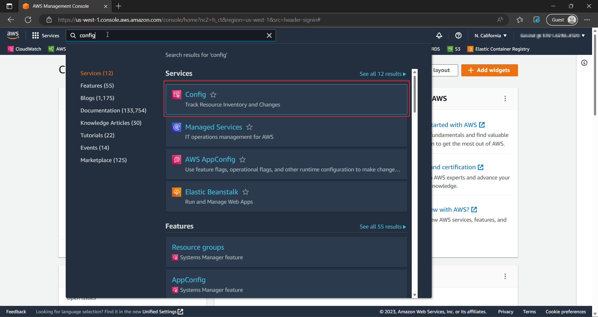

* Click on **Get Started**

    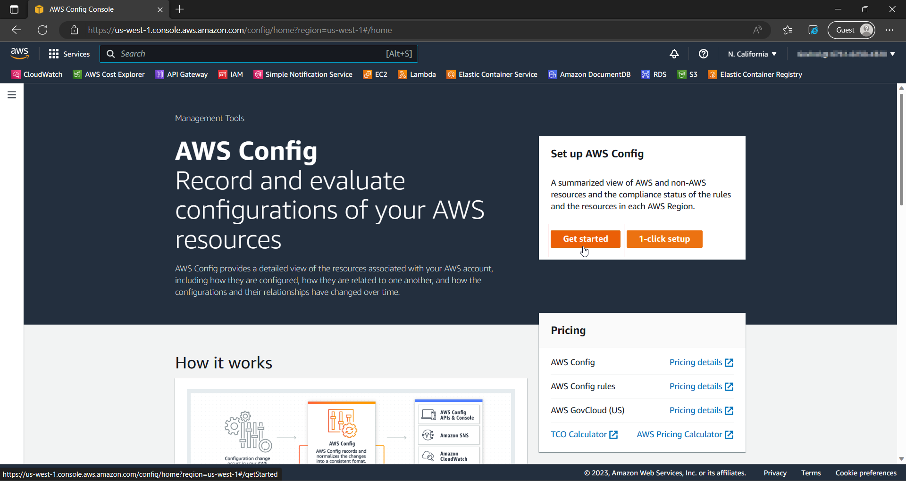

## Creating Config Rule

* In the next page, select the options as shown below
    
    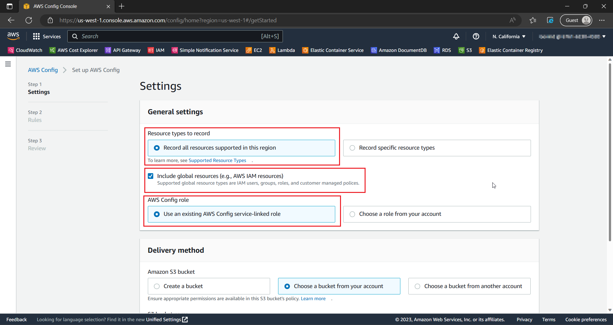

* Leave the rest as defualt and click on **Next**.

* In the **Step 2** page, search for `iam-policy-no-statements-with-admin-access` under **AWS Managed Rules**.

    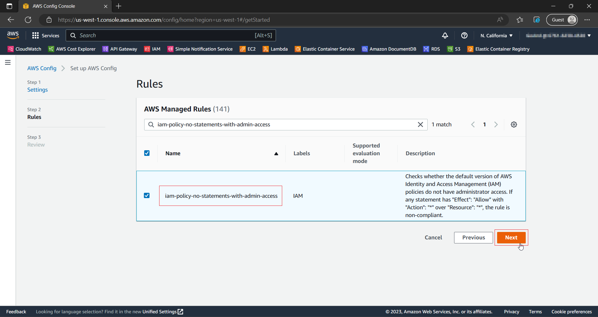

* Select that rule and click on **Next**.

* Leave all options as default in the next page and create the rule.

* We have successfully created a rule which monitors for policy that has access to all services and all resources.

* Let's check if this rule is working properly.

## Testing Config Rule

* Head to **IAM** > **Policies** > **Create Policy** on the console

    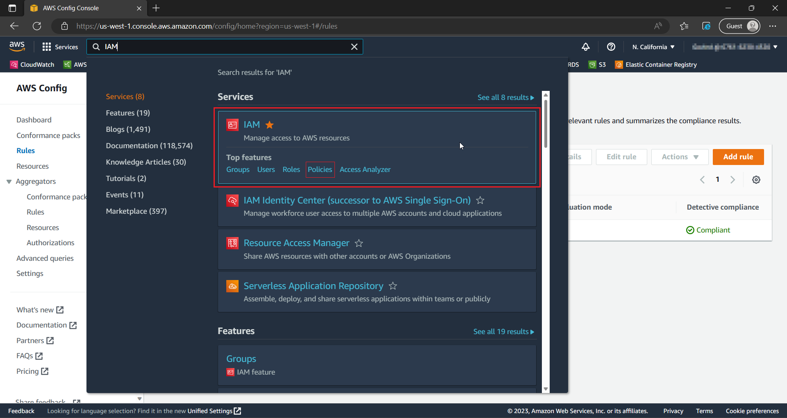

* Now, in the **Create Policy**, select on **JSON** and paste the below policy.

    ```JSON
    {
        "Version": "2012-10-17",
        "Statement": [
            {
                "Effect":"Allow",
                "Action":"*",
                "Resource":"*"
            }
        ]
    }
    ```

    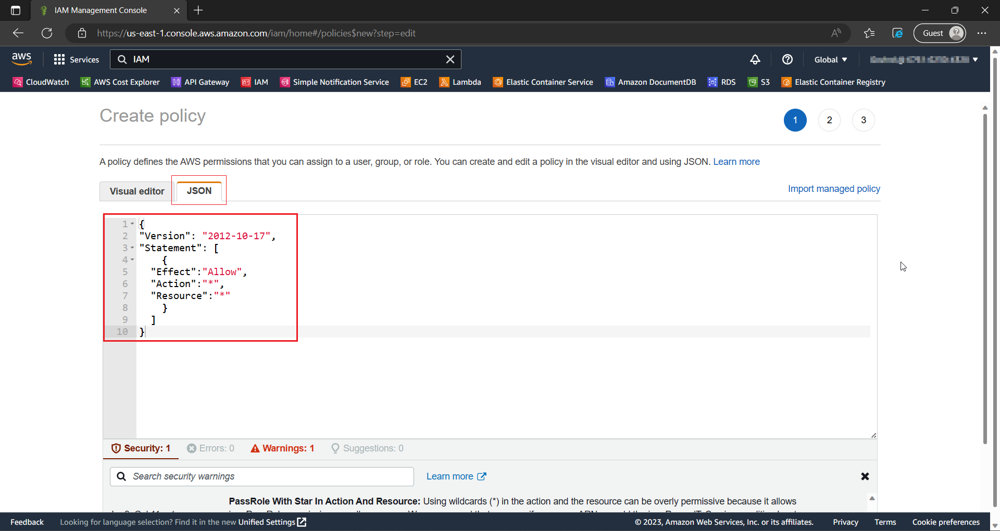

* Click on **Next** and name the policy as `FullAccessPolicy`.

    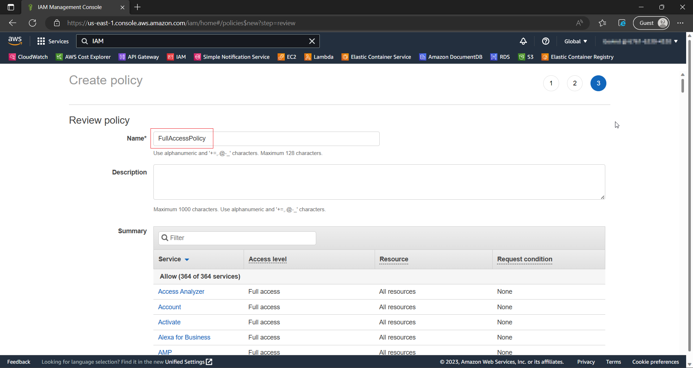

* Now, head back to **Config** > **Rules**.

    

* We can see that now we have 1 Non-Compliant Resource! click on the rule to view the **Non-Compliant Resourse**.

* Voila! it is the policy that we had just created.

    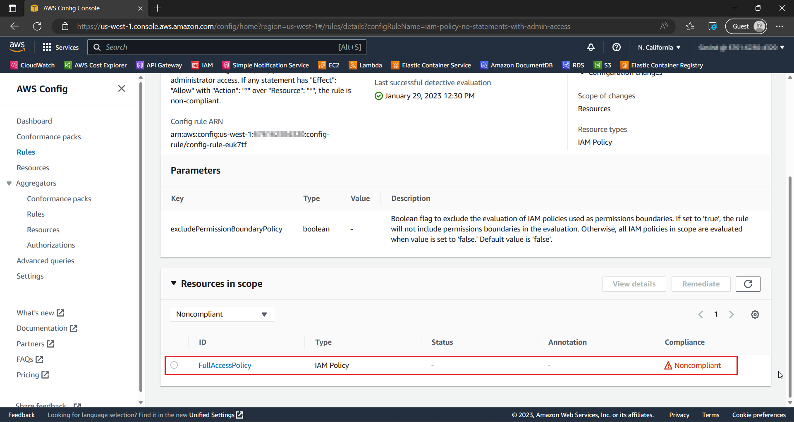

* Now, delete the policy and check if the **Detective Complaince** status has changed.

    

    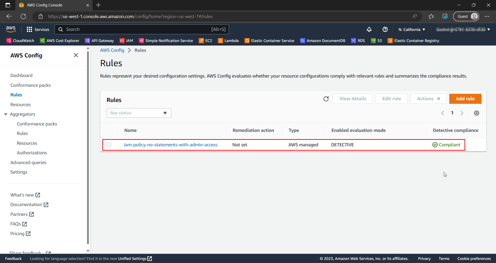

* The status changed, the rule is working perfectly! You can add more rules to monitor the changes in the configuration.

# Inferences

* AWS Config tracks and monitors changes in the configuration.

* We can trigger the evaluations periodically or trigger them when all/specific resource changes.

* When we created a policy with full access to all resources, AWS Config quickly evaluated the resources based on the trigger and changed the complaince status, this helps us identify if someone is trying to exploit our resources.

* This can help us detect the attack performed in [IAM Privilege Escalation Manual](https://github.com/ine-labs/AWSGoat/blob/master/attack-manuals/module-1/07-IAM%20Privilege%20Escalation.md). where the hacker tries to create an overly permissive policy.

# Additional Things To-Do

* By performing above steps, we can only view the complaince status in AWS Console. We won't be able to check the Config page every now and then to view the complaince status. Therefore, we need an automatic notification system.

* To do that, we can trigger the config to publish a message into an SNS Topic which in turn sends an email whenever the rule is non-complaint.

* This is possible by creating a remediation to the rule in AWS Config.

## Creating Topic

* First, head over to **Simple Notification Sevice** Page.

    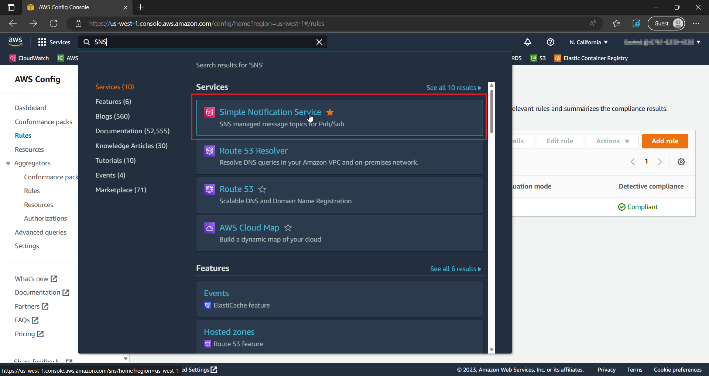

* Now, create a topic names `Config-Change-Email`.

    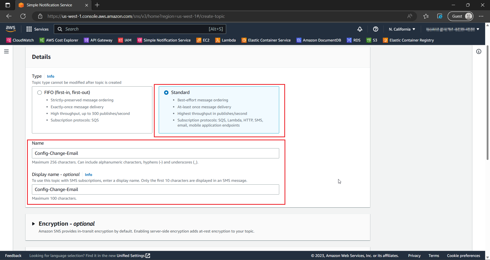

* Now, create a subscription for the topic. Select the **Protocol** as **Email** and enter the preferred email where you want to receive the notification.

    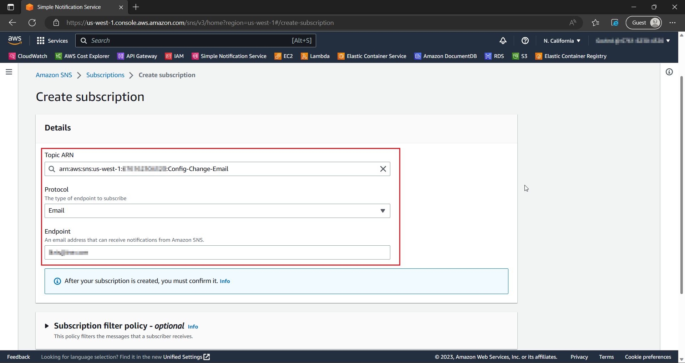

## Creating Remediation

* Head back to **Config** > **Rules** and select **Manage Remediation** under **Actions** dropdown for our rule.

    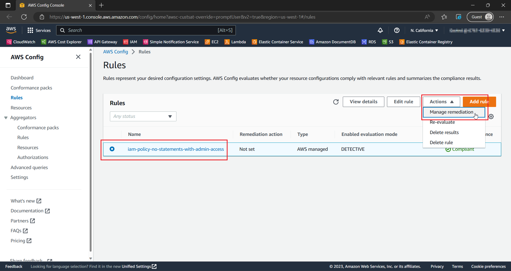

* In the next page, select the options as shown below.

    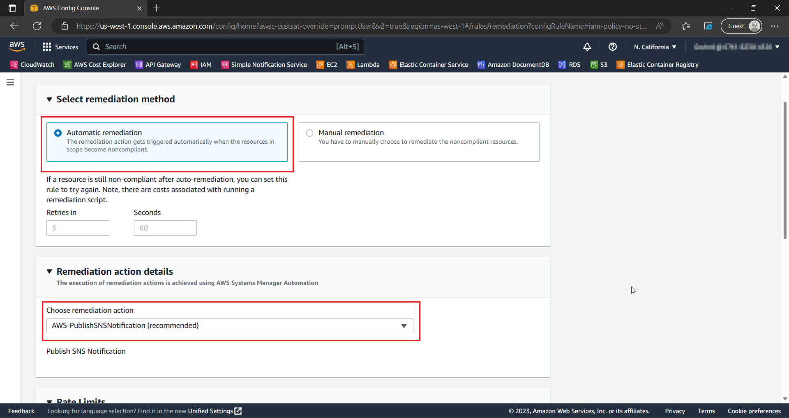

* Type in the Topic arn, Message and AutomationAssumeRole.

    

* We have successfully created a remediation. With this we will now be able to get an email notification whenever there is change in the configuration.

# Further Readings

* [What is AWS Config?](https://docs.aws.amazon.com/config/latest/developerguide/WhatIsConfig.html)

* [IAM Security Best Practices](https://docs.aws.amazon.com/IAM/latest/UserGuide/best-practices.html)

* [What is Amazon Macie?](https://docs.aws.amazon.com/macie/latest/user/what-is-macie.html)